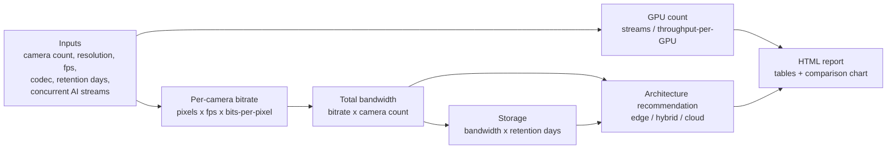

# Video Infrastructure Capacity Planner

A calculator that takes basic facts about a video surveillance / video-analytics
deployment — how many cameras, what resolution and frame rate, what codec, how
many days of footage need to be kept, and how many camera streams need live AI
inference — and turns them into concrete numbers: how much network bandwidth
is needed, how much storage is needed, how many inference GPUs are needed, and
whether the workload should run at the edge, in the cloud, or as a hybrid of
both. It produces a clean HTML report that can be handed to a customer or
saved as a record of what was quoted and why.

The real-world problem this solves: before anyone can design (or price) a
video system, someone has to turn "500 cameras across 20 buildings" into
actual megabits-per-second, terabytes, and GPU counts. Doing that math by
hand, on a call, under time pressure, is where mistakes creep in — an extra
zero in a bandwidth estimate, or forgetting that 60 days of retention costs
twice as much storage as 30 days. This tool makes that math fast, consistent,
and repeatable, and it keeps a written record of exactly which assumptions
were used.

## Why this matters

Any solution engineer who scopes infrastructure for a living runs into this
problem constantly: a customer describes their site, and before a network
diagram or a cost estimate can be produced, someone has to size the pipes,
the disks, and the compute. Getting this wrong in either direction is
expensive — undersizing means a deployment that chokes on day one (dropped
frames, missed recordings, an inference pipeline that falls behind), and
oversizing means quoting the customer for hardware and bandwidth they didn't
need to buy. A calculator that shows its formulas and states its assumptions
in the open lets a solution engineer move fast on a call while still being
able to defend every number afterward.

## How it works



## Design decisions

**Bitrate estimation.** The core formula is the standard "pixels times frames
times bits-per-pixel" rule of thumb used across the video industry for
first-pass bandwidth planning:

```
bits_per_second = (width * height) * fps * bits_per_pixel * quality_multiplier
bitrate_mbps    = bits_per_second / 1,000,000
```

`bits_per_pixel` is where codec efficiency comes in. This tool assumes H.265
(HEVC) needs roughly **half** the bits-per-pixel of H.264 (AVC) to reach
similar perceived visual quality (0.05 vs. 0.10 in the bundled table). That
one assumption directly halves the estimated bandwidth and storage for an
otherwise identical camera — which is exactly why "what codec are the cameras
running" is one of the first questions worth asking on a discovery call: it
can cut a network or storage bill in half before anything else changes. These
factors are example, industry-typical numbers, not measurements from a
specific encoder — real encoders vary with scene complexity, motion, GOP
length, and vendor firmware, so validate against real encoder output (or a
short on-site pilot) before using these numbers in a quote.

**Storage.** Storage is bandwidth integrated over time:

```
bytes_per_second = (total_bandwidth_mbps * 1,000,000) / 8
total_bytes      = bytes_per_second * 86,400 seconds/day * retention_days
storage_tb        = total_bytes / 1,000,000,000,000
```

Because this relationship is linear in `retention_days`, retention policy is
usually the single biggest lever on storage cost. Doubling retention from 30
to 60 days exactly doubles the storage bill — no other input in this tool has
that kind of direct, proportional impact once resolution/fps/codec are
decided. That is why "how long do you need to keep footage" deserves as much
attention on a discovery call as camera count does.

**GPU sizing.** GPU count comes from a small, explicit table of "how many
video streams can one reference GPU handle for this AI model at a reference
frame rate," scaled linearly for the frame rate actually needed:

```
effective_streams_per_gpu = base_streams_per_gpu * (reference_fps / target_fps)
gpu_count = ceil(concurrent_ai_streams / effective_streams_per_gpu)
```

The throughput table (`src/planner/data/gpu_benchmark_assumptions.yaml`) is
kept as a separate, swappable YAML file specifically so it is easy to replace
with real numbers. **These per-model throughput figures are illustrative
planning examples, not verified hardware benchmarks.** Saying that plainly to
a customer — "here is a rough GPU estimate based on example assumptions, and
here is what we'd need to measure to confirm it" — is more useful and more
honest than quietly presenting a guess as a fact. Unvalidated compute
estimates are a common, avoidable source of deployments that under-perform
their spec on day one.

**Edge vs. hybrid vs. cloud recommendation.** The recommendation logic is a
simple, explainable rule chain, not a black box:

1. If the estimated bandwidth **exceeds** the available WAN capacity, raw
   video physically cannot all reach the cloud at once — recommend **edge**:
   run inference locally at each site and ship only compressed
   metadata/events (detections, alerts, thumbnails) to the cloud.
2. Else, if the workload is **latency-sensitive** (e.g. access-control gate
   triggers), a round trip to a distant cloud region adds delay a local
   decision loop can't tolerate, even with bandwidth to spare — recommend
   **hybrid**.
3. Else, if the estimated bandwidth would consume more than 70% of available
   WAN capacity, there isn't enough headroom for other traffic and normal
   bitrate variance — recommend **hybrid**.
4. Otherwise, there's ample bandwidth and no latency constraint — recommend
   **cloud**.

The underlying idea: bandwidth is a hard physical constraint (you cannot ship
more bits than a link supports), while latency sensitivity is a soft-but-real
business constraint (a technically possible round trip may still be too slow
for the use case). Both push toward doing more processing close to the
cameras and only centralizing what genuinely needs to be centralized.

## Worked example: 500 cameras across 20 facilities

This exact scenario ships as `examples/500_cameras_20_sites.yaml`: 500
cameras spread across 20 facilities, 1080p resolution, 15 fps, H.265, medium
quality, 30-day retention, 100 concurrent AI inference streams running a
person-detection model at 10 fps, on a shared 500 Mbps WAN uplink.

Running it through the tool produces:

| Metric | Value |
|---|---|
| Per-camera bitrate | 1.5552 Mbps |
| Total network bandwidth | 777.6 Mbps |
| Storage (30-day retention) | 251.94 TB |
| GPUs required | 5 |
| Recommended architecture | **edge** |

What that means in plain terms: 777.6 Mbps of raw video is more than the 500
Mbps the site has available, so raw video cannot all be centralized as-is.
The recommendation is to run person-detection inference locally at each
facility and send only detections/events/thumbnails back over the WAN,
instead of full video streams. Five GPUs (using the illustrative example
throughput table) are enough to keep up with the 100 concurrent inference
streams at the 10 fps target rate.

The same config file also defines two "what-if" variants that show up in the
generated report's comparison table and chart:

- **H.264 instead of H.265** — bandwidth doubles to 1,555.2 Mbps and storage
  doubles to 503.88 TB, because H.264 is assumed to need twice the
  bits-per-pixel of H.265 at similar quality.
- **60-day retention instead of 30** — storage doubles to 503.88 TB while
  bandwidth stays at 777.6 Mbps, because storage scales linearly with
  retention but bandwidth does not depend on it at all.

Both variants land on exactly the same storage number (503.88 TB) through two
completely different levers — a good illustration of how the storage formula
is equally sensitive to "how much data per second" and "for how many days."

## Setup & run instructions

### Local (virtual environment)

```bash
python -m venv .venv
# Windows:
.venv\Scripts\activate
# macOS/Linux:
source .venv/bin/activate

pip install -r requirements.txt
pip install -e .

# Run the CLI against a bundled example
python -m planner plan --config examples/500_cameras_20_sites.yaml --out report.html

# Or the smaller single-site example
python -m planner plan --config examples/small_single_site.yaml --out report_small.html --json
```

Open `report.html` in a browser to see the generated report.

### Optional web form

```bash
uvicorn planner.webform:app --reload
```

Then open <http://127.0.0.1:8000/> in a browser, fill in the form, and submit
to get the same report rendered inline.

### Docker

```bash
docker build -t video-infra-capacity-planner .

# Default command: computes the 500-camera example and writes report.html inside the container
docker run --rm video-infra-capacity-planner

# Run the web form instead, exposed on localhost:8000
docker run --rm -p 8000:8000 video-infra-capacity-planner \
  uvicorn planner.webform:app --host 0.0.0.0 --port 8000
```

## Project structure

```
video-infrastructure-capacity-planner/
├── Dockerfile
├── LICENSE
├── README.md
├── pyproject.toml
├── requirements.txt
├── .github/
│   └── workflows/
│       └── ci.yml
├── examples/
│   ├── 500_cameras_20_sites.yaml
│   ├── 500_cameras_20_sites_expected_output.json
│   ├── small_single_site.yaml
│   └── small_single_site_expected_output.json
├── src/
│   └── planner/
│       ├── __init__.py
│       ├── __main__.py
│       ├── calculator.py       # core formulas
│       ├── cli.py               # `python -m planner plan ...`
│       ├── report.py            # HTML report + chart generation
│       ├── webform.py           # optional FastAPI interactive form
│       ├── data/
│       │   └── gpu_benchmark_assumptions.yaml
│       └── templates/
│           └── report_template.html
└── tests/
    ├── test_calculator.py
    ├── test_examples.py
    └── test_report.py
```

## Testing

```bash
pip install -r requirements.txt
pip install -e .
pytest -v
ruff check .
```

The test suite covers:

- Unit tests for every calculator function against hand-computed expected
  values (the arithmetic is shown in comments next to each assertion).
- A parametrized test that loads every `examples/*.yaml` file, runs the full
  calculation pipeline, and checks the result against the matching
  `examples/*_expected_output.json` within a small numeric tolerance.
- A test that the generated HTML report actually contains the key computed
  figures (bandwidth, storage, GPU count, and the recommendation) and a valid
  embedded chart image.

All 33 tests pass as of this writing (`33 passed`).

## Limitations & production hardening notes

- **Validate the assumptions before quoting.** Both the codec bits-per-pixel
  table and the GPU throughput table are example, illustrative planning
  numbers, not vendor-verified benchmarks. Before this tool's output is used
  to quote or design a real deployment, validate bitrate assumptions against
  real encoder output from the actual camera models, and validate GPU
  throughput against real measurements on the actual GPU/model/precision
  combination that will be deployed.
- **No redundancy/failover overhead.** The storage and bandwidth numbers are
  raw ingestion requirements only. They do not add RAID/erasure-coding
  overhead, N+1 GPU or NVR redundancy, multi-site failover bandwidth, or
  database/metadata/thumbnail storage overhead. Add margin for these in a
  real design.
- **No scene-complexity / VBR modeling.** Real cameras use variable bitrate
  encoding, so a busy scene (heavy motion, lots of detail) will use
  noticeably more bandwidth than a static scene at identical settings. This
  tool estimates an average bitrate for a "typical" scene and does not model
  that variance — treat its bandwidth/storage numbers as a planning midpoint,
  not a worst-case peak.
- **No protocol/framing overhead.** Bandwidth totals do not add RTP/RTSP
  headers, retransmits, or other network-layer overhead. A common practice is
  to add a 20-30% safety margin on top of the raw estimate when sizing an
  actual link.

## License

MIT — see [LICENSE](LICENSE).
